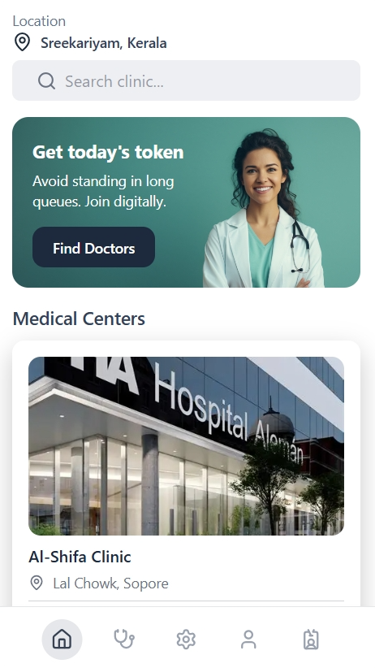
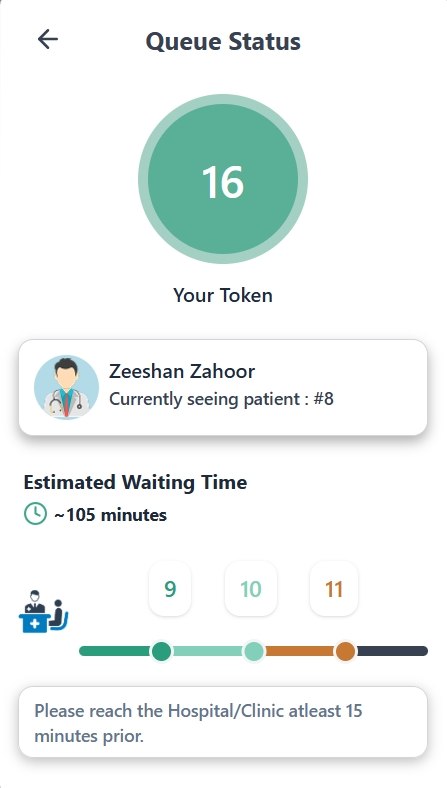
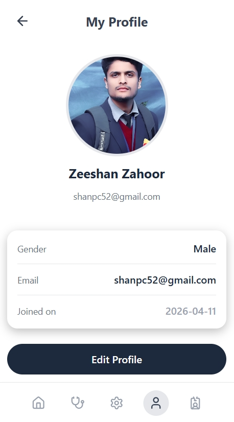
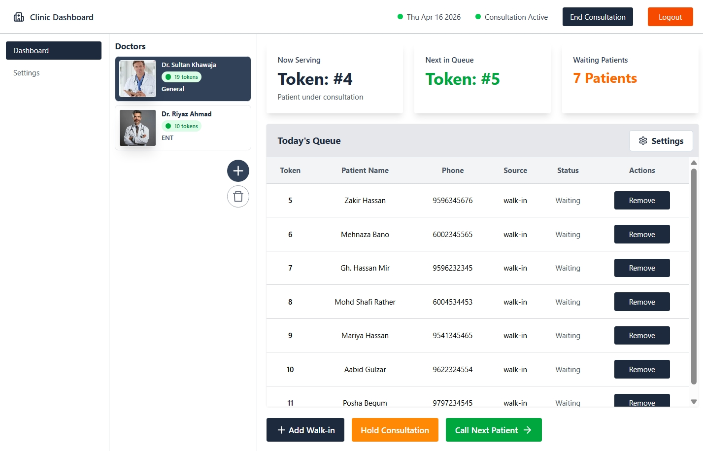

# ➕ QueueCare – Smart Queue Management System

QueueCare is a full-stack web application designed to eliminate long waiting times in clinics by enabling patients to get tokens remotely and track their turn in real-time, while clinics manage patient flow efficiently through a dedicated dashboard.

---

## 🌐 Live Demo

👉 https://queuecare-app.vercel.app

---

## 📌 Problem Statement

In many clinics, patients wait physically for long time without for their turn. This leads to:

* Wasted time
* Poor patient experience
* Inefficient patient management

---

## 💡 Solution

QueueCare solves this by:

* Allowing patients to **join queues by getting token remotely**
* Providing **real-time queue tracking**
* Enabling clinics to **manage tokens and patient flow digitally**

---

## ✨ Features

### 👤 Patient Side

* Join clinic queues (get token) remotely
* Real-time queue position tracking
* View active tokens and status
* User authentication (Email + Google OAuth)
* Profile management with image upload
* Location-based clinic discovery (future)

---

### 🏥 Clinic Side

* Dashboard to manage queue
* Add / remove doctors
* Control consultation status
* Token generation and queue handling
* Doctor profile management (with image upload)
* Clinic settings management.

---

### 🔐 Authentication & Security

* JWT-based authentication
* Google Sign-In integration
* Protected routes
* Secure API handling

---

### ⚙️ Core Functionality

* Queue token system
* Duplicate entry prevention
* Queue capacity management
* Real-time status updates
* Backend validation and error handling

---

## 🧪 Demo Data

This project includes **demo clinics** for showcasing functionality.

> Clinics are manually onboarded to ensure a controlled and realistic experience.

---

## 🛠️ Tech Stack

### Frontend

* React (Vite)
* Tailwind CSS
* React Router
* Lenis (smooth scrolling)

### Backend

* Node.js
* Express.js
* MongoDB (Mongoose)

### Authentication

* JWT (JSON Web Tokens)
* Google OAuth (Google Identity Services)

### Cloud & Deployment

* Frontend: Vercel
* Backend: Render
* Database: MongoDB Atlas
* Image Storage: Cloudinary

---

## 🧱 Project Structure

```
QueueCare/
├── queuecare-frontend/
│   ├── src/
│   ├── components/
│   ├── pages/
│   └── ...
│
├── queuecare-backend/
│   ├── src/
│   ├── controllers/
│   ├── models/
│   ├── routes/
│   └── ...
```

---

## ⚙️ Environment Variables

### Backend (.env)

```
PORT=
MONGO_URI=

CLINIC_ACCESS_TOKEN_SECRET=
CLINIC_ACCESS_TOKEN_EXPIRY=

USER_ACCESS_TOKEN_SECRET=
USER_ACCESS_TOKEN_EXPIRY=

CLOUDINARY_CLOUD_NAME=
CLOUDINARY_API_KEY=
CLOUDINARY_API_SECRET=

EMAIL=
EMAIL_PASSWORD=

GOOGLE_CLIENT_ID=
```

---

### Frontend (.env)

```
VITE_BACKEND_URL=https://your-backend-url.onrender.com
VITE_GOOGLE_CLIENT_ID=your_google_client_id
```

---

## 🚀 Local Setup

### 1. Clone the repository

```
git clone https://github.com/your-username/QueueCare.git
cd QueueCare
```

---

### 2. Setup Backend

```
cd queuecare-backend
npm install
npm run dev
```

---

### 3. Setup Frontend

```
cd queuecare-frontend
npm install
npm run dev
```

---

## ⚠️ Important Notes

* Free backend hosting (Render) may cause **cold start delays (~30–60s)** after inactivity.
* Google OAuth requires correct domain configuration in Google Cloud Console.
* Demo clinics are used for showcasing functionality.

---

## 🎯 Key Highlights

* Real-world problem solving application
* Full-stack architecture with role-based system
* Secure authentication with OAuth integration
* Clean, modern UI/UX design
* Fully deployed and production-ready

---

## 📸 Screenshots

### 👤 Patient App

#### 🏠 Home (Clinic List)



#### 🎫 Queue Status



#### 👤 Profile



---

### 🏥 Clinic Dashboard

#### 📊 Dashboard



#### ⚙️ Settings


---

## 🔮 Future Improvements

* Push notifications (Socket.IO)
* Appointment booking system
* Clinic onboarding request system
* Analytics dashboard
* PWA support

---

## 👨‍💻 Author

**Zeeshan Zahoor**

* GitHub: https://github.com/your-username
* LinkedIn: https://linkedin.com/in/your-profile

---

## 📄 License

This project is licensed under the MIT License.

---

## ⭐ Support

If you found this project useful, consider giving it a star ⭐ on GitHub!